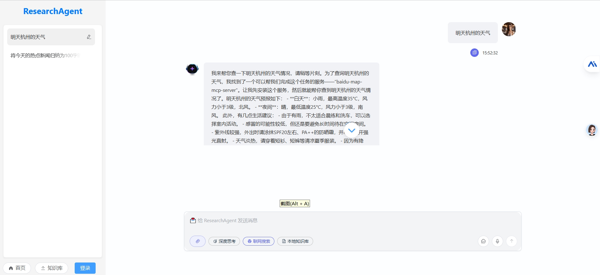

# ResearchAgent

<a href="./README.md">简体中文</a> | <a href="./README_en.md">English</a> 

> 快速构建AIGC项目

ResearchAgent是Java生态下AIGC项目解决方案，集成AIGC大模型能力，帮助企业和个人快速定制AI知识库、AI智能体、企业AI机器人等服务和应用。

**开源地址：**

- Gitee：https://gitee.com/tzarrb/research-agent
- Github：https://github.com/tzarrb/research-agent
- GitCode: https://gitcode.com/tzarrb/research-agent

**开源不易，欢迎Star、fork 持续关注**

**支持的AI大模型：** DeepSeek / 阿里通义 / 百度千帆 / 抖音豆包 / 智谱清言 / OpenAI / Gemini / Ollama / Azure / Claude 等大模型。

## 技术栈

- **核心框架**: Spring Boot、SpringCloud
- **AI 能力**: Spring AI、Spring AI Alibaba (集成阿里云 DashScope)
- **向量存储**: PGVector、ElasticSearch, Milvus, Redis Vector Store
- **动态配置**: Nacos
- **检索增强生成**: RAG 架构
- **Agent**: 多Agent路由架构
- **前端框架**: Vue3、Element Plus、Element Plus X

## 功能特性

1. 多模态：支持集成国内外数十家AI大模型，可动态切换和配置
2. 知识库：支持向量化知识库文档，定制化Prompt对话场景
3. 高级RAG：支持多种Embedding模型和向量库；集成Web Search等RAG插件
4. 多Agent：支持多Agent路由架构，支持Agent间的协同工作
5. Tool Call：支持定制化Tool工具类，实现本地函数调用，从第三方加载数据并提供给LLM
6. MCP: 支持Nacos3.0 MCP和Router动态配置
7. 动态配置：支持Nacos动态配置大模型参数、Key等信息，无感刷新、无需每次重启服务
8. 支持动态配置Embedding模型和向量数据库，当前已支持PGVector、ElasticSearch，后续将持续添加 
9. 支持基于令牌数、句子、文档格式、关键字和摘要元数据等多种分块嵌入方式
10. 更多特性敬请期待...

## 版本更新
- 2025.07.25 支持多种嵌入分块策略，新增ES向量库支持
- 2025.06.28 正式发布、公开仓库
- 2024.10.05 开始开发

## 预览

## 感谢

- [LangChain4j](https://github.com/langchain4j/langchain4j)
- [Spring AI](https://spring.io/projects/spring-ai)
- [Spring AI Alibaba](https://spring.io/projects/spring-ai-alibaba)

## 联系

- Github: https://github.com/tzarrb
- 邮箱: tzarrb@gmail.com
